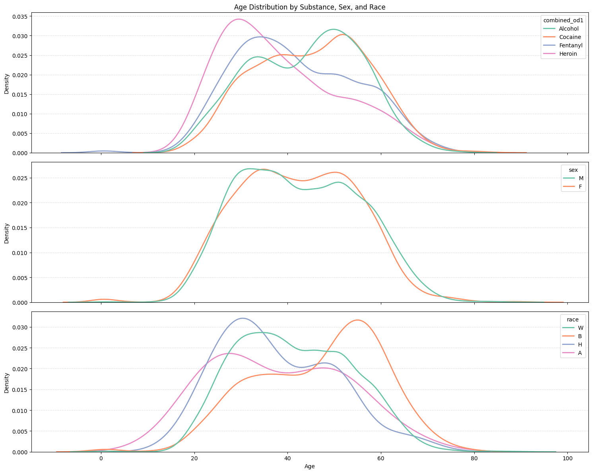
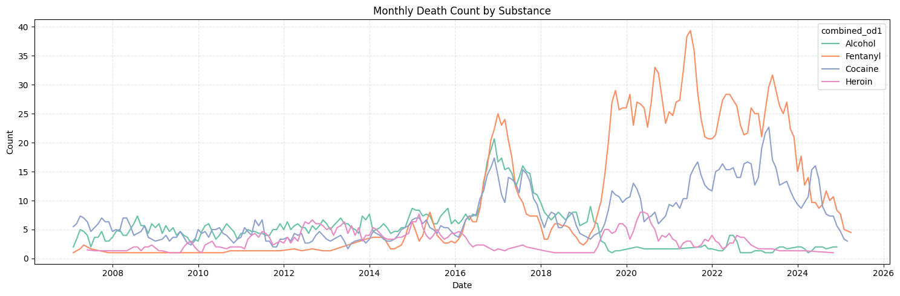

```python
# Setup and import required libraries
import warnings
warnings.filterwarnings('ignore')

import numpy as np
import pandas as pd
import matplotlib.pyplot as plt
import seaborn as sns
```

In order to tell a comprehensive story, some figures contain multiple subplots. The two visualizations are titled “Age Distribution by Substance, Sex, and Race”, “Monthly Death Count by Substance”. The data used for the visualizations is titled “Allegheny County Fatal Accidental Overdoses” and can be found here https://data.wprdc.org/dataset/allegheny-county-fatal-accidental-overdoses. The dataset contains 20 attributes of mostly object types with 7,318 rows. Let us take a second to realize that is 7,318 lives lost to drug overdoses, let us not get lost in an abstraction of numbers.

The first visualization contains three frequency distribution subplots of age with a categorical hue. The subset of categories looks at the most commonly used drugs that were the primary cause of death. Although the dataset contains 9 other attributes that show people with possible combinations of substances, we focus on the primary drug: Heroin, Cocaine, Fentanyl, and Alcohol. The figure shows 4 kernel density estimation plots (KDEs) visualizing the age distribution of overdoses and the associated substance. The hue and number of the categorical data made overlapping histogram bins difficult to distinguish and are therefore excluded. Perhaps the most interesting aspect of this visualization is the <strong>increase in death rate for people over 40 who use cocaine or alcohol</strong>, in contrast there is an <strong>increase in death rate for people under the age of 40 who use heroin or fentanyl.</strong> Sex does not seem to play an influential role in the age distribution for overdoses. The last notable trend shows Black people are more frequently overdosing at an older age. Understanding these trends can help us target which demographics might be struggling with certain issues, not all addictions are the same, and these distributions could potentially inform treatments. 

The second visualization is a time series. The dataset attribute needed for the timestamp, "death_date_and_time" is cast into the correct type. We look at the same 4 substances that were mentioned above; during a time window of about 18 years from 2007-2025. There is a very clear <strong>increase in overdoses during the pandemic</strong>, specifically for cocaine and fentanyl, though, thankfully, the <strong>trend seems to be decreasing.</strong>

Understanding trends allows us to evaluate potential outreach programs that target these demographics. The specifics are crucial in formulating public health policies that are tailored to the needs of citizens.


---


```python
df = pd.read_csv('overdoses.csv')

substance_df = df[df["combined_od1"].isin(["Heroin", "Cocaine", "Fentanyl", "Alcohol"])]
race_df = df[df["race"].isin(["W", "B", "H", "A"])]

fig, axes = plt.subplots(3, 1, figsize=(15, 12), sharex=True)

sns.kdeplot(data=substance_df, x="age", hue="combined_od1", palette="Set2", common_norm=False, linewidth=2, ax=axes[0],)
axes[0].set_xlabel("Age")
axes[0].set_ylabel("Density")
axes[0].set_title("Age Distribution by Substance, Sex, and Race")
axes[0].grid(True, axis="y", linestyle="--", alpha=0.4)

sns.kdeplot(data=df, x="age", hue="sex", palette="Set2", common_norm=False, linewidth=2, ax=axes[1])
axes[1].set_xlabel("Age")
axes[1].set_ylabel("Density")
axes[1].grid(True, axis="y", linestyle="--", alpha=0.4)

sns.kdeplot(data=race_df, x="age", hue="race", palette="Set2", common_norm=False, linewidth=2, ax=axes[2])
axes[2].set_xlabel("Age")
axes[2].set_ylabel("Density")
axes[2].grid(True, axis="y", linestyle="--", alpha=0.4)

plt.tight_layout()
plt.show()
```


    

    


```python
counts = (
    substance_df
    .assign(death_date_and_time=lambda d: pd.to_datetime(d['death_date_and_time']))
    .groupby(['combined_od1', pd.Grouper(key='death_date_and_time', freq='M')])
    .size()
    .rename('occurrences')
    .reset_index()
    .sort_values('death_date_and_time')
    .groupby('combined_od1', group_keys=False)
    .apply(lambda g: g.assign(smoothed=g['occurrences']
                              .rolling(window=3, center=True, min_periods=1)
                              .mean()))
)

plt.figure(figsize=(15, 5))
sns.lineplot(data=counts, x='death_date_and_time', y='smoothed',
             hue='combined_od1', palette="Set2")
plt.title("Monthly Death Count by Substance")
plt.xlabel("Date")
plt.ylabel("Count")
plt.grid(True, ls='--', alpha=.3)
plt.tight_layout()
plt.show()
```


    

    


```python

```
